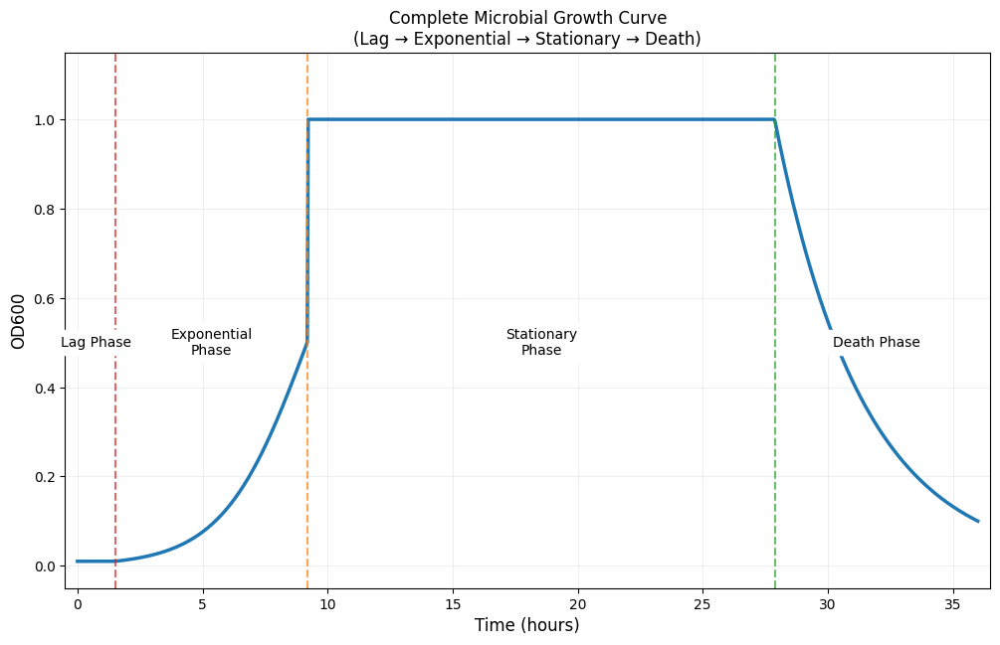

# Bioinformatics and Microbial Growth Modeling Notebook

This Jupyter notebook contains two core functionalities:
1. **DNA to Protein Sequence Translation**
2. **Microbial Growth Curve Simulation**

---

## Code Overview

### 1. DNA to Protein Translation
#### Key Components:
- **DNA Sequence Input**: A sample DNA sequence is provided for translation.
- **Codon-to-Amino Acid Mapping**: A dictionary maps DNA codons to their corresponding amino acids.
- **Custom Translation Function**: `DNA_to_Protein()` splits the DNA sequence into codons and converts them to a protein sequence.
- **Biopython Implementation**: Uses `Bio.Seq` for transcription and translation validation.

#### Example Output:
```
Protein Sequence: MTMITDSRLPAS*PGSAERKFASGLLTASRWPP*PTTMYDQDGRRSIWTTTMT*PWPISGPGGGDEFEYAEFDRFFSGDQASMTYEMADLQDRVSVFGAA
```

---

### 2. Microbial Growth Curve Simulation
#### Key Components:
- **Four-Phase Model**: Simulates lag, exponential, stationary, and death phases of microbial growth.
- **Customizable Parameters**: Adjust time, initial population, carrying capacity, phase durations, and decay.
- **Logistic Growth Formula**: Models population dynamics using logistic growth equations.
- **Visualization**: Plots the growth curve with annotated phase transitions.

#### Example Output:


---

## Requirements
- Python 3.x
- Jupyter Notebook
- Libraries:
  - `biopython`
  - `numpy`
  - `matplotlib`

Install dependencies:
```bash
pip install biopython numpy matplotlib
```
